# План улучшения сервиса авторизации для микросервисной архитектуры

## Анализ текущей архитектуры

### Сильные стороны:
✅ **Stateless архитектура** - использование JWT токенов без серверных сессий  
✅ **Spring Cloud Eureka** - уже подключен для service discovery  
✅ **Чистая архитектура** - разделение на слои (API, Domain, Infrastructure)  
✅ **Spring Security** - надежная основа для безопасности  
✅ **Actuator** - готовность к мониторингу  

### Проблемы для микросервисной среды:

🔴 **Отсутствие API Gateway интеграции** - нет централизованной точки входа  
🔴 **Жестко закодированные роли** - все пользователи получают `ROLE_ADMIN`  
🔴 **Отсутствие валидации токенов между сервисами** - нет endpoint'а для проверки токенов  
🔴 **Нет разделения ответственности** - сервис делает и аутентификацию, и авторизацию  
🔴 **Отсутствие refresh токенов** - нет механизма обновления токенов  
🔴 **Нет централизованного управления пользователями** - смешение auth и user management  
🔴 **Отсутствие distributed tracing** - нет корреляции запросов между сервисами  
🔴 **Нет rate limiting** - уязвимость к атакам  

## Ключевые улучшения для микросервисной архитектуры

### 1. Разделение ответственности (Separation of Concerns)

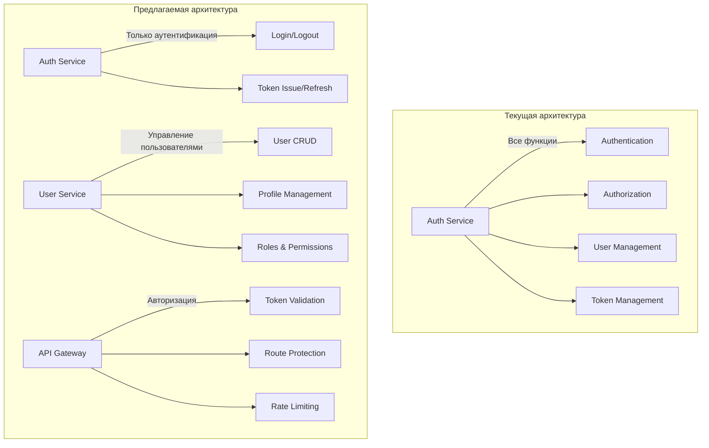

### 2. Архитектура взаимодействия с другими сервисами

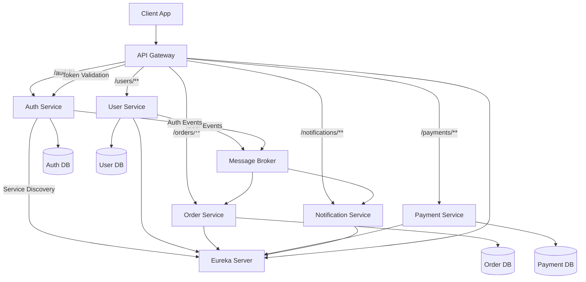

### 3. Детальная архитектура взаимодействия

#### A. API Gateway как единая точка входа
- Все внешние запросы проходят через Gateway
- Валидация JWT токенов на уровне Gateway
- Маршрутизация запросов к соответствующим сервисам
- Rate limiting и circuit breaker

#### B. Inter-service Communication Patterns

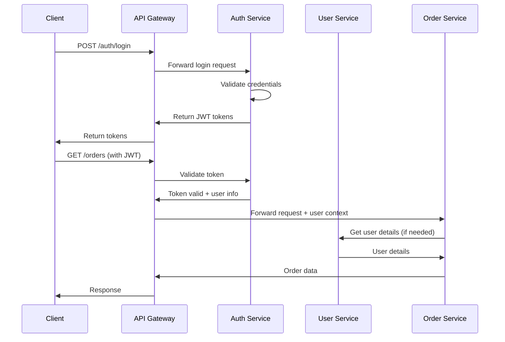

#### C. Event-Driven Architecture для асинхронного взаимодействия

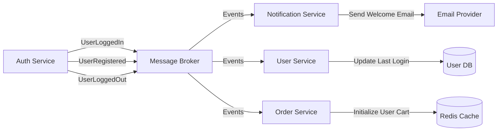

## 4. Улучшения безопасности и масштабируемости

### A. Многоуровневая архитектура безопасности

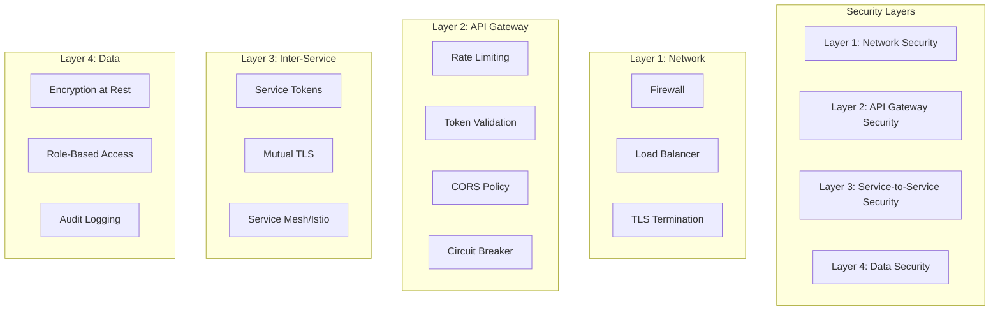

### B. JWT Token Strategy для масштабируемости

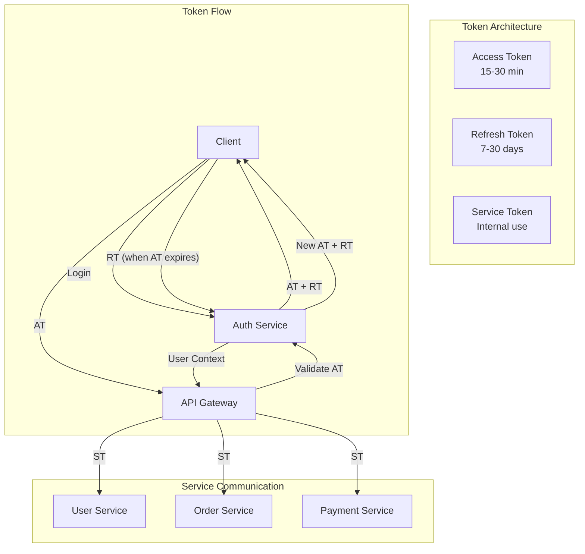

### C. Горизонтальное масштабирование

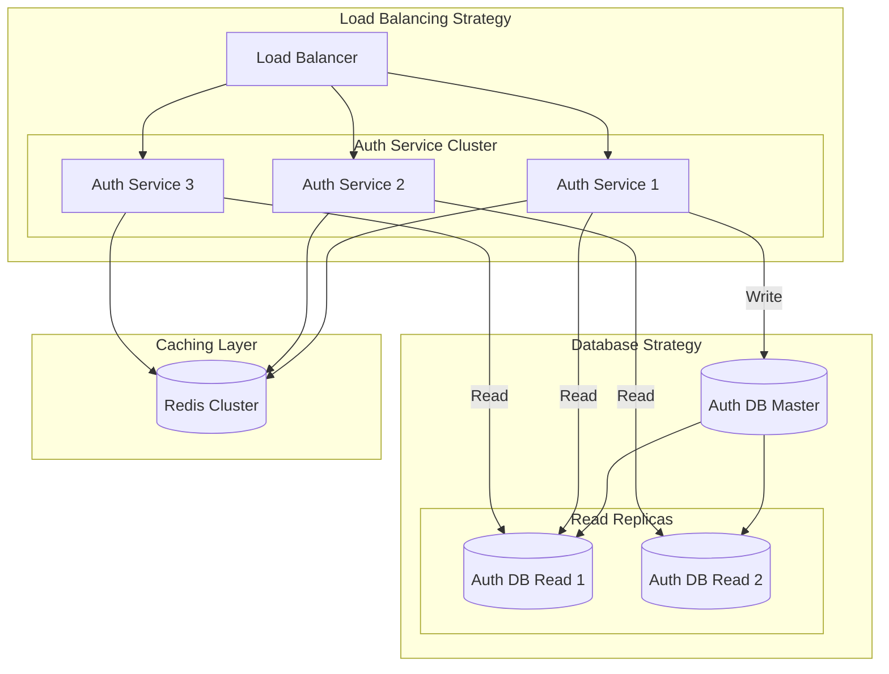

### D. Security Patterns для микросервисов

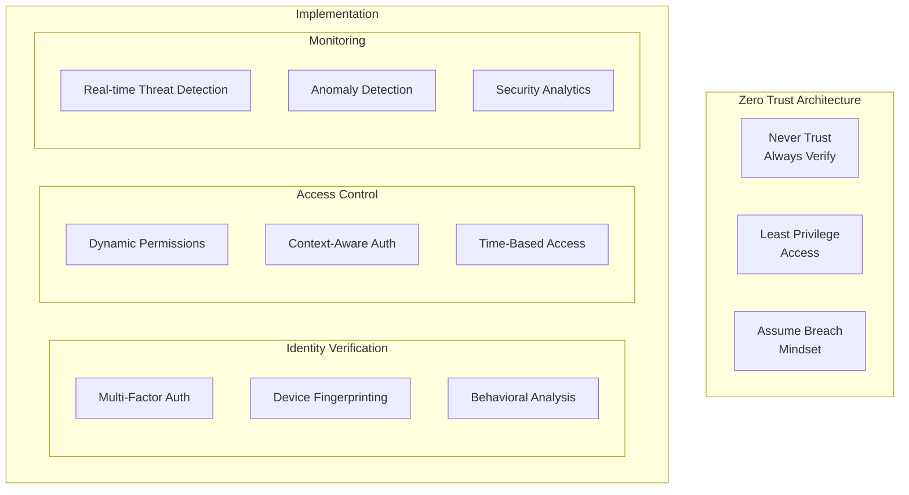

## 5. План миграции и развертывания

### A. Поэтапная миграция (Strangler Fig Pattern)

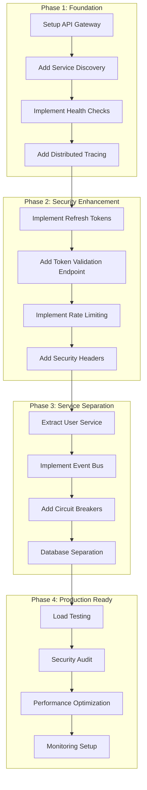

### B. Deployment Strategy

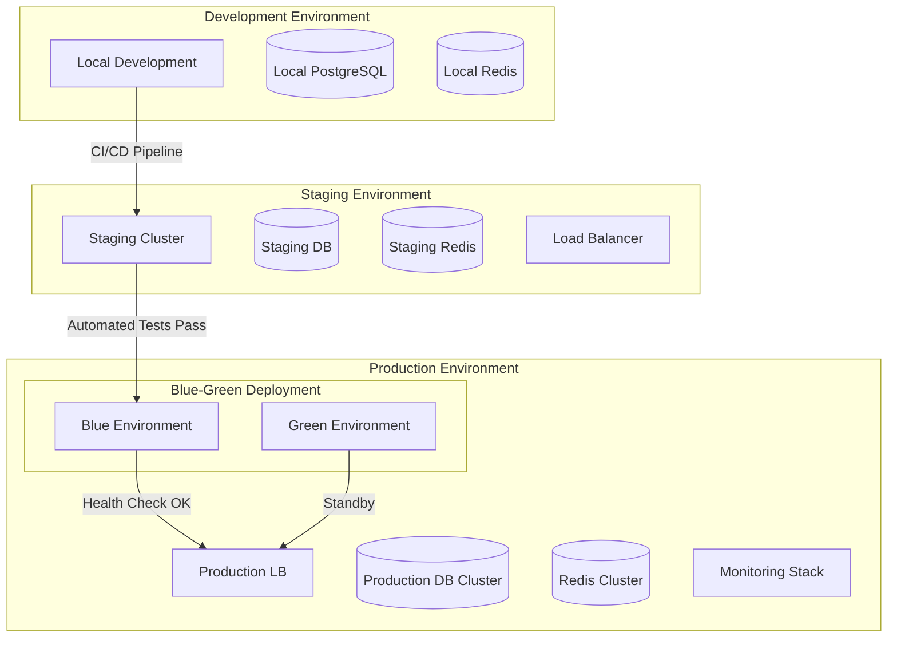

### C. Infrastructure as Code

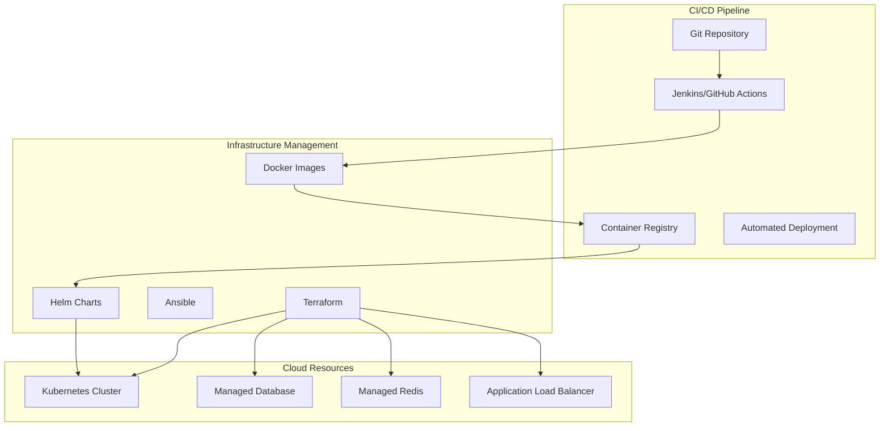

## 6. Мониторинг и наблюдаемость

### A. Observability Stack

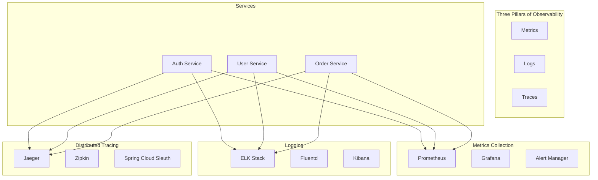

### B. Key Performance Indicators (KPIs)

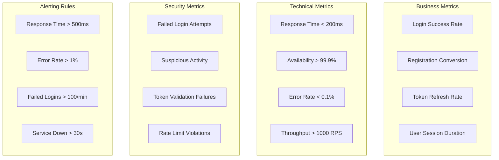

### C. Health Check Strategy

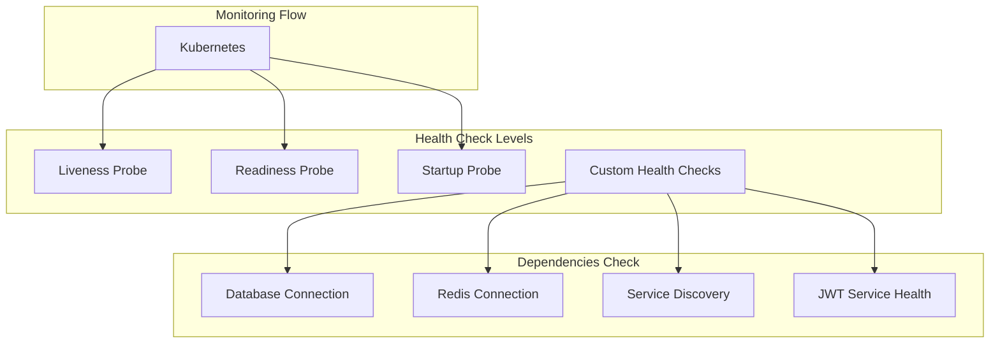

## Приоритеты внедрения

### Высокий приоритет (Фаза 1):
1. **API Gateway** - централизованная точка входа
2. **Token Validation Endpoint** - для межсервисного взаимодействия
3. **Refresh Tokens** - улучшение безопасности
4. **Health Checks** - готовность к production

### Средний приоритет (Фаза 2):
1. **User Service Extraction** - разделение ответственности
2. **Event-Driven Architecture** - асинхронное взаимодействие
3. **Rate Limiting** - защита от атак
4. **Distributed Tracing** - наблюдаемость

### Низкий приоритет (Фаза 3):
1. **Advanced Security Features** - MFA, behavioral analysis
2. **Performance Optimization** - кэширование, оптимизация запросов
3. **Advanced Monitoring** - custom metrics, alerting
4. **Load Testing & Optimization** - подготовка к высоким нагрузкам

## Заключение

Данный план обеспечивает поэтапную трансформацию текущего монолитного сервиса авторизации в полноценный микросервис, готовый к интеграции в большую распределенную систему. Ключевые преимущества предлагаемой архитектуры:

- **Масштабируемость**: горизонтальное масштабирование и load balancing
- **Безопасность**: многоуровневая защита и zero trust подход
- **Наблюдаемость**: полный контроль над системой через metrics, logs и traces
- **Отказоустойчивость**: circuit breakers, health checks и graceful degradation
- **Гибкость**: возможность независимого развития и развертывания сервисов